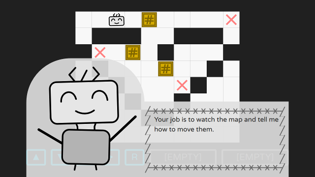

# Boxie Coody - An HTML5 Puzzle Game

Boxie Coody is an Sokuban-like puzzle game, participating [GitHub Game Off 2016](https://github.com/blog/2274-game-off-theme-announcement).

## Introduction

It is your first day as a worker of _BoxieHub_.
Coody, your fellow robot, will teach how to finish your daily work.

_Welcome to BoxieHub!_

In this game, you can

* meet Coody the cute robot
* move the boxies with the Coody's help
* hack Coody (really?)

## How to Play

Play at [http://lastflower.github.io/game-off-2016](http://lastflower.github.io/game-off-2016) with **latest Chrome or Firefox**.

Use mouse to control, or keyboard shortcuts
* space to communicate
* arrow keys or WASD to move
* [1] [2] to use a special program
* [R] to undo last step
* [L] to reset whole level (secret :)

## CREDIT

LastFlower Team (LastLeaf, tongtongggggg)

* Game design: LastLeaf, tongtongggggg
* Coding: LastLeaf
* Art & SE: LastLeaf, tongtongggggg

Special Thanks to Chossy Zhang for testing and advices.

Our GitHub Game Off 2015 Game, _A Lighted Story_ is also playable at GitHub Pages. [Play _A Lighted Story_](http://mistymiracle.github.io/a-lighted-story/)

## Screenshot

## About the Code and Tools

This game is based on HTML5 technologies.
Unlike HTML5 canvas games, this game is largely based on SVG and simple DOM animations,
so that it can work without any game framework.

Some SVG graphics is done with [Inkscape](https://inkscape.org/).
Sound effects is done with [LMMS](https://lmms.io/) and [GeneralUser GS](http://www.schristiancollins.com/generaluser.php).

## LICENSE

The content of this game is under [Creative Commons Attribution-ShareAlike 4.0 International](https://creativecommons.org/licenses/by-sa/4.0/).
The software of this game is under [MIT LICENSE](https://opensource.org/licenses/mit-license.html).
The [Varela Round](https://github.com/alefalefalef/Varela-Round-Hebrew) font is under [Open Font License](http://scripts.sil.org/cms/scripts/page.php?site_id=nrsi&id=OFL_web).
