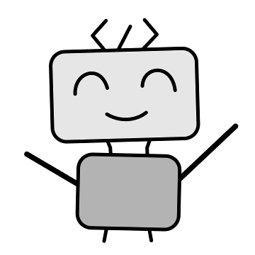

# Boxie Coody - An HTML5 Puzzle Game

Boxie Coody is an Sokuban-like puzzle game, participating [GitHub Game Off 2016](https://github.com/blog/2274-game-off-theme-announcement).

## Introduction

It is your first day as a worker of _BoxieHub_.
Coody, your fellow robot, would teach how to finish your daily work.

_Welcome to BoxieHub!_

In this game, you could

* meet Coody the cute robot
* move the boxies with the help of Coody
* hack Coody (really?)

## Abort the Code and Tools

This game is based on HTML5 technologies.
Unlike HTML5 canvas games, this game is largely based on SVG and simple DOM animations,
so that it could work without any game framework.

The original SVG graphics is done with [Inkscape](https://inkscape.org/).
Sound effects is done with [LMMS](https://lmms.io/) and [GeneralUser GS](http://www.schristiancollins.com/generaluser.php).

## LICENSE

The content of this game is under [Creative Commons Attribution-ShareAlike 4.0 International](https://creativecommons.org/licenses/by-sa/4.0/).
The software of this game is under [MIT LICENSE](https://opensource.org/licenses/mit-license.html).
